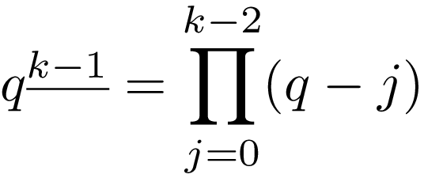

# Bernoulli numbers
An efficient implementation of the zeta-function algorithm for accurate 
computing Bernoulli numbers [1]. The code was written in Python using math and 
decimallibs.

## Introduction
The Bernoulli numbers are a sequence of rational numbers which are widely used 
in mathematics. The explicit definition is given by Louis Saalschütz in 1893 and
 could be written as

But the explicit computation of the large Bernoulli numbers is irrelevant and co
uld be inaccurate. The more accurate way is to define the numerator and the 
denominator of the accurate fraction. Thereby the program prints the numerator, 
the denominator and the decimal fraction after n for the n-th Bernoulli number.

## Algorithm
The general procedure for n > 1.

where p is primes up to n. And (p-1)|n means (p-1) divides n.

## Applications
One of the most important application of the Bernoulli numbers is in the 
numerical computation of integrals by the Euler–Maclaurin formula

Here the first Bernoulli number is +1/2.

Another essential application could be found in the computation of 
Faulhaber's formula

In 1713, Jacob Bernoulli showed that such sum could be expressed as

where the falling factorial is

We have computed the following sum

The result is

    322580645161290322580645161790322580645161290322580645411290322580645161290322580645161290322580645161290322546811827956989247311827956989247311827956989247311827962644247311827956989247311827956989247311827956989247310979706989247311827956989247311827956989247311827956989355699327956989247311827956989247311827956989247311827945466822311827956989247311827956989247311827956989247312825955739247311827956989247311827956989247311827956989178554466456989247311827956989247311827956989247311827960646658436827956989247311827956989247311827956989247311683433845606402737047898338220918866080156402737047898342247811378580156402737047898338220918866080156402737047824896521215294651584974165619326909649490294651584974166400652868699490294651584974165619326909649490294651584970207375822076316156961318251640832285993576316156961318257656641025000000000000000000000000000

The total CPU time was less than 2s for 1 core of Intel(R) Core(TM) i5-2520M CPU @ 2.50GHz.

## References
[1] Kevin J. McGown, Computing Bernoulli Numbers Quickly, 2005.

